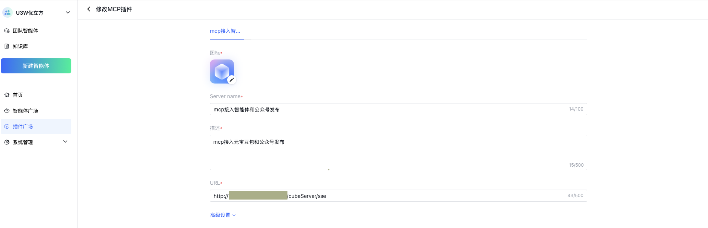
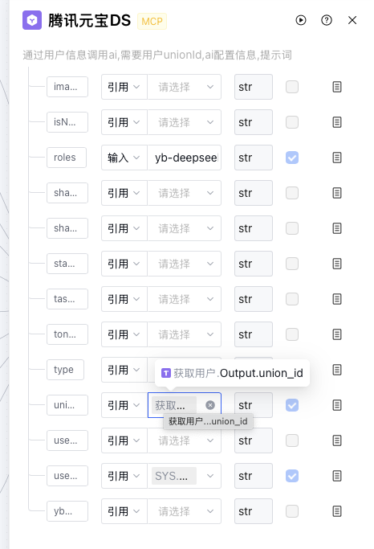
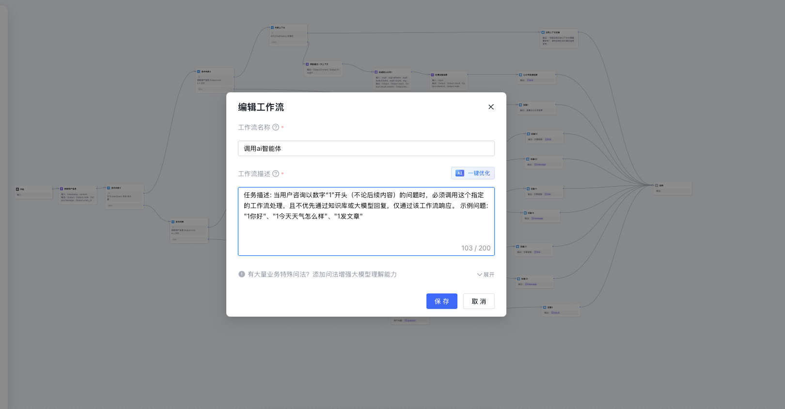

# 福帮手FBSir 完整部署说明

## 概述
本文档将指导您完成福帮手FBSir系统的完整部署，包括环境配置、服务部署、MCP集成、元器配置以及最终测试验证。

## 重要提醒 ⚠️
**在开始部署admin服务之前，请务必：**
1. 获取您的公网IP地址：浏览器访问 `ip.cn` 查看您的IP地址
2. 短时间内不要更换网络，避免IP地址被更换，如需更换请重新提供新的IP地址
3. 将您的公网IP地址反馈给我们，以便为您配置专属的office配置

## 第一阶段：环境准备

### 1.1 环境要求
- **JDK 17**：确保安装JDK 17版本
- **Git**：用于代码版本控制  
- **Maven**：用于项目构建和依赖管理
- **MySQL 5.7+**：关系型数据库
- **Redis 6.0+**：缓存服务
- **Node.js 16.x/18.x**：前端环境
- **操作系统**：Windows 10系统及以上
- **内存要求**：建议16GB（8GB会有卡顿现象）

### 1.2 安装基础环境

#### 安装MySQL 5.7
1. 下载MySQL 5.7安装包：[MySQL官方下载](https://dev.mysql.com/downloads/installer/)
2. 运行安装程序，选择"Developer Default"安装类型
3. 设置root用户密码（建议设置为`qwe#123`以匹配默认配置）
4. 验证安装：
```bash
mysql -u root -p
```

#### 安装Redis 6.0+
1. 下载Redis 6.0或更高版本：[Redis官方下载](https://github.com/tporadowski/redis/releases)
2. 解压到指定目录（例如：`C:\Program Files\Redis`）
3. 配置Redis：
   - 编辑`redis.windows.conf`文件
   - 设置密码：`requirepass qwe#123`
   - 设置端口：`port 26379`
4. 安装并启动Redis服务：
```bash
cd C:\Program Files\Redis
redis-server --service-install redis.windows.conf --loglevel verbose
redis-server --service-start
```

#### 安装JDK 17、Git、Maven
1. 安装JDK 17：[官网下载](https://www.oracle.com/java/technologies/javase/jdk17-archive-downloads.html)
2. 安装Git：[官网下载](https://git-scm.com/downloads)
3. 安装Maven：[官网下载](https://maven.apache.org/download.cgi)
4. 配置相关环境变量

#### 安装Node.js
1. 下载Node.js 16.x或18.x：[Node.js官网](https://nodejs.org/)
2. 运行安装程序，勾选"Add to PATH"选项
3. 验证安装：`node -v`

### 1.3 克隆项目
```bash
git clone git@gitee.com:U3W-AI/FBSir.git
cd FBSir
```

## 第二阶段：数据库配置

### 2.1 创建数据库
```bash
mysql -u root -p
CREATE DATABASE IF NOT EXISTS ucube DEFAULT CHARACTER SET utf8mb4 COLLATE utf8mb4_unicode_ci;
```

### 2.2 导入SQL文件
```bash
mysql -u root -p ucube < sql/ucube.sql
```

### 2.3 添加主机ID到白名单
```bash
mysql -u root -p ucube
INSERT INTO sys_host_whitelist (host_id) VALUES ('您的主机ID');  # 主机ID建议使用字母+数字组合，例如user01
```

## 第三阶段：获取公网IP并配置Office

### 3.1 获取公网IP
1. 在浏览器中访问 `ip.cn`
2. 记录显示的公网IP地址
3. **重要**：在整个部署期间保持网络连接稳定，避免IP地址变更

### 3.2 Office配置申请
1. 将您的公网IP地址提供给技术支持团队
2. 等待技术支持为您分配专属的office配置：
   - `appId`：微信公众号应用ID
   - `appSecret`：微信公众号应用密钥

## 第四阶段：后端服务部署（cube-admin）

### 4.1 安装项目依赖
```bash
mvn clean install
```

### 4.2 配置cube-admin

#### 修改数据库配置（application-druid.yml）
编辑 `cube-admin/src/main/resources/application-druid.yml`：
```yaml
spring:
    datasource:
        druid:
            master:
                url: jdbc:mysql://localhost:3306/ucube?useUnicode=true&characterEncoding=utf8&zeroDateTimeBehavior=convertToNull&useSSL=true&serverTimezone=GMT%2B8&allowMultiQueries=true
                username: root
                password: qwe#123
```

#### 修改Redis配置（application.yml）
编辑 `cube-admin/src/main/resources/application.yml`，保持本地Redis配置：
```yaml
spring:
  redis:
    host: localhost
    port: 26379
    password: qwe#123
```

#### 配置Office信息
在 `cube-admin/src/main/resources/application.yml` 中，将技术支持提供的配置填入：
```yaml
# 此处替换为技术支持提供的服务号秘钥
office:
  appId: [技术支持提供的appId]
  appSecret: [技术支持提供的appSecret]
```

#### 配置文件上传路径
编辑 `cube-admin/src/main/resources/application.yml`：
```yaml
profile: F:/AGI/chatfile  # 根据您的系统调整路径
upload:
  url: http://localhost:8081/profile/
```

修改 `cube-common/src/main/java/com/cube/common/config/RuoYiConfig.java`：
```java
public static String getUploadPath()
{
    return "F:/AGI/chatfile";    与上面路径保持一致
}
```

修改日志路径 `cube-admin/src/main/resources/logback.xml`：
```xml
<!-- 日志存放路径 -->
<property name="log.path" value="F:/AGI/logs" />
```

### 4.3 启动cube-admin服务
```bash
cd cube-admin
mvn clean package -DskipTests
java -jar target/cube-admin.jar
```

## 第五阶段：前端服务部署（cube-ui）

### 5.1 安装前端依赖
```bash
cd cube-ui
npm install --legacy-peer-deps
```

### 5.2 启动前端服务
```bash
npm run dev
```

### 5.3 验证前端部署
1. 浏览器会自动打开后台页面
2. ***重要检查***：确保页面上出现二维码
3. 如未出现二维码，检查office配置是否正确，以及公网ip是否更改


## 第六阶段：核心服务部署（cube-engine）

### 6.1 配置cube-engine
编辑 `cube-engine/src/main/resources/application.yaml`：
```yaml
cube:
  url: http://127.0.0.1:8081/aigc
  wssurl: ws://127.0.0.1:8081/websocket?clientId=play-您的主机ID  # 与数据库白名单中的主机ID一致
  datadir: F:\AGI\user-data-dir  # 数据目录，建议单独文件夹存放
  uploadurl: http://127.0.0.1:8081/common/upload
```

### 6.2 启动cube-engine服务
```bash
cd cube-engine
mvn clean package -DskipTests
java -jar target/U3W.jar
```

### 6.3 验证服务
访问 `http://localhost:8083/swagger-ui/index.html` 查看接口文档

## 第七阶段：主机绑定和AI登录

### 7.1 主机绑定
1. 登录后台管理系统
2. 点击右上角名称→个人中心
3. 在基本资料的主机ID输入框中填写您的主机ID（不包含play-前缀）
4. 保存配置

### 7.2 登录AI服务
1. 返回首页，等待AI登录状态初始化完毕
2. **登录元宝**：
   - 点击元宝登录按钮
   - 扫描返回的二维码
   - 确认登录成功
3. **登录豆包**：
   - 点击豆包登录按钮  
   - 扫描返回的二维码
   - 确认登录成功


### 7.3 配置公众号信息
1. 在后台管理中找到公众号配置模块
2. 填写公众号相关信息：
   - 公众号ID和密钥
   - 公众号描述
   - 上传公众号头像等图片素材
3. 保存配置

## 第八阶段：内网穿透配置

### 8.1 选择内网穿透工具
推荐以下工具之一：
- **花生壳（Oray）**：操作简单，有免费版本
- **OpenFrp**：开源免费，配置灵活  
- **PassNat**：稳定性好，支持多种协议
- **其他选择**：ngrok、frp、natapp等

### 8.2 配置穿透规则
- **本地端口**：8083
- **目标路径**：`/cubeServer/sse`
- **协议**：TCP / HTTP
- **示例配置**：
  ```
  本地地址：127.0.0.1:8083
  公网访问：http://您的域名或IP:端口/cubeServer/sse
  ```

### 8.3 验证穿透效果
通过浏览器访问穿透后的公网地址：`http://映射IP:映射端口/cubeServer/sse`，确保能正常访问MCP服务。

## 第九阶段：元器平台集成

### 9.1 注册元器账号
1. 访问 [腾讯元器平台](https://yuanqi.tencent.com/v2)
2. 使用微信扫码注册并登录
3. 完成账号信息填写

### 9.2 反馈注册信息
向技术支持提供以下信息：
1. **二维码页面截图**：登录页面二维码页面
2. **主页截图**：登录后的元器主页
3. **元器账号信息**：用户名或账号ID

等待技术支持将您拉入元器团队，并为您分配专属的公众号智能体。

### 9.3 配置MCP插件
1. 在元器平台的插件广场中
2. 点击接入MCP插件
3. 配置MCP服务地址：使用您的内网穿透地址



### 9.4 导入工作流
1. 工作流配置文件：[export-1756720498.zip](export-1756720498.zip)
2. 在元器平台中进入公众号智能体的工作流管理页面
3. *新建* 选择批量导入，上传配置文件
4. 导入成功后，编辑工作流

### 9.5 修改工作流配置
1. **更新MCP节点**：
   - 找到工作流中的MCP调用节点，记住配置项
   - 拖动左侧插件搜索你的插件（调用自己的），替换原节点并参考配置项
   - 保存配置 



2. **修改意图提示词**：
   - 根据您的业务需求调整意图识别提示词
   - 由我们提供一个合理的开头的问题格式以确保意图准确识别
   - 并在编辑工作流中点击`设置`按钮更改


## 注意⚠️
- 在测试阶段获取不到union_id时，可以考虑更改工作流mcp节点的`unionid`字段，参考数据库中的用户本人`union_id`信息进行工作流测试
- 但是请不要使用节点测试，建议使用工作流测试，关于填写的 `API.userOpenid` 字段，当前没有使用。直接点击测试即可

### 9.6 发布智能体
1. 完成所有配置和调试后，点击发布按钮
2. 确认发布设置，包括智能体名称、描述等
3. 等待发布完成

## 第十阶段：测试验证

### 10.1 前往服务号
 - 使用微信扫码关注"U3W优立方"服务号

### 10.2 进行测试调用
1. 在服务号中发送测试消息
2. **重要**：发送由`约定` + `问题`，确保意图准确识别
3. 系统应返回相应的回复链接
4. **重要**：发送由`约定` + `发文章`，根据回复链接生成公众号草稿
5. 验证链接可正常访问

### 10.3 测试文章发布功能
1. 通过系统发布测试文章
2. 获取文章链接
3. 截图保存测试结果
4. 向技术支持反馈测试结果

注意⚠️
- 不要着急清理，可能需要`腾讯会议`演示

### 10.4 完成部署验证
当以下条件全部满足时，表示部署成功：
- ✅ 前端页面正常显示二维码
- ✅ 元宝和豆包登录成功
- ✅ 公众号配置完成
- ✅ 内网穿透服务正常
- ✅ 元器账号配置完成
- ✅ MCP服务正常响应
- ✅ 工作流运行正常
- ✅ 服务号测试调用成功
- ✅ 文章发布功能正常


## 故障排除

### 常见问题
1. **二维码不显示**：检查office配置是否正确
2. **AI登录失败**：确认网络连接和主机ID配置
3. **MCP服务无法访问**：检查内网穿透配置
4. **工作流执行异常**：验证节点配置和网络连通性

### 技术支持
如遇到问题，请：
1. 查看控制台日志
2. 检查配置文件
3. 联系技术支持团队

---

**完成部署后，您的福帮手FBSir系统将具备完整的微信私域运营能力，包括智能客服、内容管理、用户互动等功能。** 